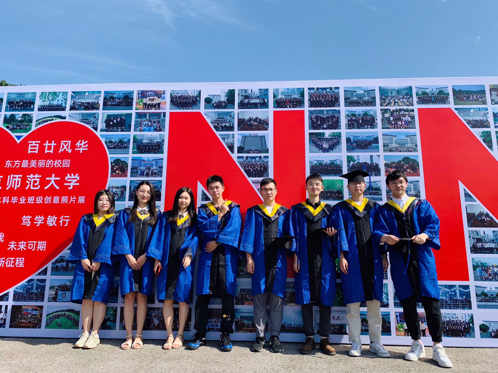

  <ul style="overflow: hidden">
  
  </ul>
  Based on Danny.Z 

## Gallery

### Anecodate

* <a href=" ">About my graduation</a>
	- Date: 2022.6.8
	- I graduated from NNU.

 

*  <a href=" ">Be a common man</a>
	- Date: 2022.7.22
	- What I think about.

 

* <a href="../images/video/twocat.mp4" target="_blank">Xiao Mi (小咪) & Da Mi (大咪)</a>
	- Date: 2022.6.3
	- Something about two cats.

