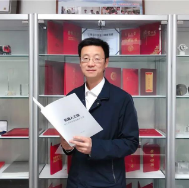
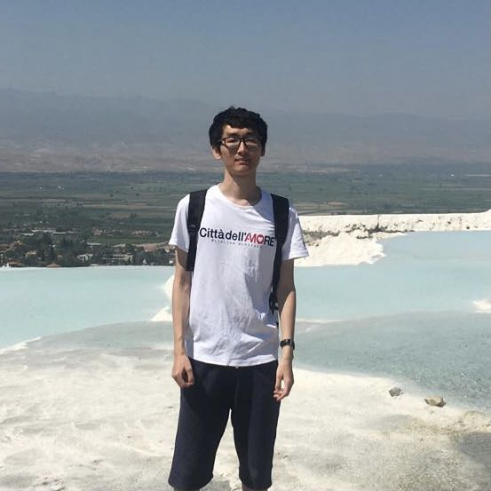

### <strong>About Me</strong>
<!--  -->
I was a <del>script kiddie</del> and received the B.S. degree from <a href="http://www.njtech.edu.cn/">Nanjing Tech University</a>, Nanjing, China, in 2019. I am currently 
pursuing the M.S degree of <a href="http://www.njnu.edu.cn/">Nanjing Normal University</a>, Nanjing, China. I am looking for a passionate research group to sutdy for Ph.D.
 
My research interests including Machine Learning, Deep Learning, Computer Vision and Human Activity Recognition. My advisor is <a href="http://d.njnu.edu.cn/person/3288.html">A.P Lei Zhang</a> now. 
By the way, I must express my gratitude to <a href="https://sci-hub.se/alexandra">Alexandra Elbakyan</a>. The website built by her helps me much on paper writing and search.
Everyone can find the papers they need <a href="https://sci-hub.st/">here [Sci-Hub]</a>.
 
→ The Homepage is designed under my self-righteous aesthetics ←  
<!-- <del>Select the part inside the arrow to reveal the hidden content.</del> -->

<!--  -->

<!-- ### <strong>Skills & Hobbies (Sort by Proficiency)</strong>

#### <strong>Skills</strong>
* Languages
    - Python (PyTorch, Jittor, Keras, TensorFlow).
	- C#, LaTeX.
	- SQL, Kotlin.

#### <strong>Hobbies</strong>
* Sports
    - Cycling.
	- Rope Skipping.

* Recreation
    - Drum Set.
	- Card Game (OCG like Yo☆Gi☆Oh).
	- Drawing. -->

### <strong>CV</strong>
You can download my latest [CV (English Version)](https://wenbohuang1002.github.io/papers/Wenbo Huang's CV.pdf) and [CV (Chinese Version)](https://wenbohuang1002.github.io/papers/黄文博的简历.pdf). 
CV was last updated on October 25, 2021. 
<!-- <pre>
                            CV was last updated on October 25, 2021.
　　　　　／＞＿＿＿フ       
　　　　　|  　_　 _|   
　 　　　／  ミ  ˇ ノ  
　　 　 /　　　 　 |
　　　 /　 ヽ　　 ﾉ
　 　 │　　|　|　|
　／￣|　　 |　|　|
　| (￣ヽ＿_ヽ_)__) 
　＼二つ
</pre> -->

### <strong>News</strong>

{{ article.date }} :
<em>{{ article.headline }}</em>

#### <a href="{{ site.url }}{{ site.baseurl }}/allnews.html">[See All News]</a>
#### <a href="#top">[Go Back to Top]</a>

  <ul style="overflow: hidden">
  
  </ul>

  <!--   -->

  Wenbo Huang (黄文博)   
  401, Qi Ming Building (<a href="https://j.map.baidu.com/f3/pAk">Maps</a>).   
  <a href="http://d.njnu.edu.cn/research-area/3205.html">Institute of Infirmation and Control Technologies</a>     
  <a href="http://d.njnu.edu.cn/">School of Electric and Autumation Engineerning</a>    
  <a href="http://www.njnu.edu.cn/">Nanjing Normal University</a>    
  Nanjing, Jiangsu, China.    
  
  <a href="{{ site.url }}{{ site.baseurl }}/treasures">All failures are my treasures.</a>    

### <strong>Publications (Journal Papers & Conference Papers)</strong>



 

 <pubtit>{{ publi.title }}</pubtit>

 

 
{{ publi.description }}

 
<em>{{ publi.authors }}</em>

 
{{ publi.venue }}

 
 
{{ publi.name }}

 
 
{{ publi.DOI }}

 
 
[<a href="{{ publi.link1.url }}">{{ publi.link1.display }}</a>]

 

 
 
[<a href="{{ publi.link1.url }}">{{ publi.link1.display }}</a>]
 [<a href="{{ publi.link2.url }}">{{ publi.link2.display }}</a>]

 

 
 
[<a href="{{ publi.link1.url }}">{{ publi.link1.display }}</a>]
 [<a href="{{ publi.link2.url }}">{{ publi.link2.display }}</a>]
 [<a href="{{ publi.link3.url }}">{{ publi.link3.display }}</a>]

 

 
 
[<a href="{{ publi.link1.url }}">{{ publi.link1.display }}</a>]
 [<a href="{{ publi.link2.url }}">{{ publi.link2.display }}</a>]
 [<a href="{{ publi.link3.url }}">{{ publi.link3.display }}</a>]
 [<a href="{{ publi.link4.url }}">{{ publi.link4.display }}</a>]

 

 
 
[<a href="{{ publi.link1.url }}">{{ publi.link1.display }}</a>]
 [<a href="{{ publi.link2.url }}">{{ publi.link2.display }}</a>]
 [<a href="{{ publi.link3.url }}">{{ publi.link3.display }}</a>]
 [<a href="{{ publi.link4.url }}">{{ publi.link4.display }}</a>]
 [<a href="{{ publi.link5.url }}">{{ publi.link5.display }}</a>]

 

 
 
[<a href="{{ publi.link1.url }}">{{ publi.link1.display }}</a>]
 [<a href="{{ publi.link2.url }}">{{ publi.link2.display }}</a>]
 [<a href="{{ publi.link3.url }}">{{ publi.link3.display }}</a>]
 [<a href="{{ publi.link4.url }}">{{ publi.link4.display }}</a>]
 [<a href="{{ publi.link5.url }}">{{ publi.link5.display }}</a>]
 [<a href="{{ publi.link6.url }}">{{ publi.link6.display }}</a>]

 

 



 

#### <a href="{{ site.url }}{{ site.baseurl }}/publications">[See All Publications]</a>

#### <a href="#top">[Go Back to Top]</a>

### <strong>Theses</strong>



 

 <pubtit>{{ publi.title }}</pubtit>

 

 
{{ publi.description }}

 
<em>{{ publi.authors }}</em>

 
{{ publi.venue }}

 
 
{{ publi.name }}

 
 
{{ publi.DOI }}

 
 
[<a href="{{ publi.link1.url }}">{{ publi.link1.display }}</a>]

 

 
 
[<a href="{{ publi.link1.url }}">{{ publi.link1.display }}</a>]
 [<a href="{{ publi.link2.url }}">{{ publi.link2.display }}</a>]

 

 
 
[<a href="{{ publi.link1.url }}">{{ publi.link1.display }}</a>]
 [<a href="{{ publi.link2.url }}">{{ publi.link2.display }}</a>]
 [<a href="{{ publi.link3.url }}">{{ publi.link3.display }}</a>]

 

 
 
[<a href="{{ publi.link1.url }}">{{ publi.link1.display }}</a>]
 [<a href="{{ publi.link2.url }}">{{ publi.link2.display }}</a>]
 [<a href="{{ publi.link3.url }}">{{ publi.link3.display }}</a>]
 [<a href="{{ publi.link4.url }}">{{ publi.link4.display }}</a>]

 

 
 
[<a href="{{ publi.link1.url }}">{{ publi.link1.display }}</a>]
 [<a href="{{ publi.link2.url }}">{{ publi.link2.display }}</a>]
 [<a href="{{ publi.link3.url }}">{{ publi.link3.display }}</a>]
 [<a href="{{ publi.link4.url }}">{{ publi.link4.display }}</a>]
 [<a href="{{ publi.link5.url }}">{{ publi.link5.display }}</a>]

 

 
 
[<a href="{{ publi.link1.url }}">{{ publi.link1.display }}</a>]
 [<a href="{{ publi.link2.url }}">{{ publi.link2.display }}</a>]
 [<a href="{{ publi.link3.url }}">{{ publi.link3.display }}</a>]
 [<a href="{{ publi.link4.url }}">{{ publi.link4.display }}</a>]
 [<a href="{{ publi.link5.url }}">{{ publi.link5.display }}</a>]
 [<a href="{{ publi.link6.url }}">{{ publi.link6.display }}</a>]

 

 



 &nbsp; 

#### <a href="#top">[Go Back to Top]</a>

### <strong>Academic Related</strong>

#### <strong>Academic Service</strong>
* <strong>Journal Reviewer</strong>
    - <a href="https://www.mdpi.com/journal/sensors">MDPI Sensors</a>, 2021

* <strong>Conference Reviewer</strong>
    - I am working on it...

#### <strong>Award & Honor</strong>
* <strong>Competition</strong> 
    - Provincial Third Prize, The 17th "Challenge Cup" National University Student Extracurricular Academic Science and 
	Technology Works Competition "Science and Technology" Special Competition, 2021

* <strong>Scholarship</strong>
    - National Scholarship for Postgraduate Students in 2021 (rank 1, total 65)
	- First-class Academic Scholarship of Nanjing Normal University in 2021 (rank 6, total 65)

#### <a href="#top">[Go Back to Top]</a>

### <strong>Research Partners (Partial)</strong>

#### <strong>Research Advisors</strong>

 <a href="http://d.njnu.edu.cn/person/3288.html">Lei Zhang</a> Associate Professor NNU

 <a href="https://sites.google.com/site/hejunzz/">Jun He</a> Associate Professor NUIST

 <a href="http://www.ise.ynu.edu.cn/teacher/805">Hao Wu</a> Associate Professor YNU

 <a href="https://scholar.google.com/citations?hl=zh-CN&user=RjQ5TrEAAAAJ">Aiguo Song</a> Professor SEU

#### <strong>Schoolmates</strong>

 <a href="https://github.com/tengqi159">Qi Teng</a> Ph.D Student NJU

 <a href="https://github.com/KennCoder7">Kun Wang (Kenn)</a> Ph.D Student SEU

 <a href="https://yinntag.github.io/">Yin Tang</a> M.S Student NNU

 <a href="https://github.com/Chauncey-Wang">Xing Wang</a> M.S Student NNU

#### <a href="#top">[Go Back to Top]</a>

